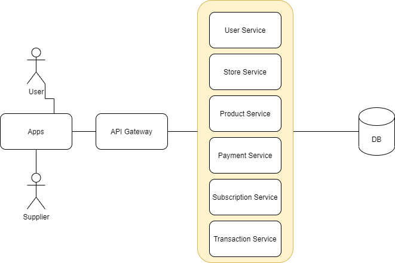
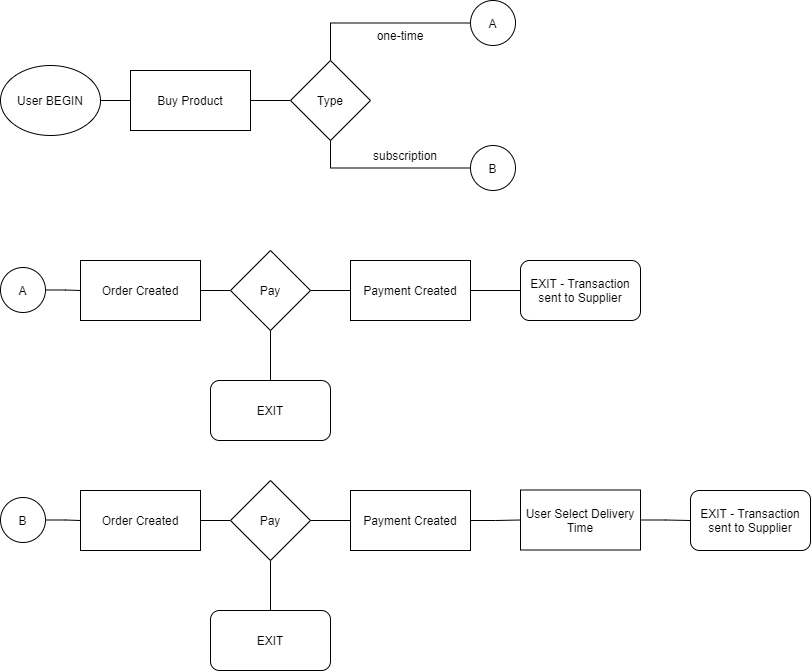

## Backend Developer Preliminary Test - Kulina
By: Farhan Ramadhan Syah Khair / farhanramadhansk@gmail.com

#### Basic concepts
##### Coding
  - A. Code can be smelly if you want to iterate some array, but the array it self can be an array of a or b. But you have to process a and b in the same way. You can prevent this by creating interface, so instead you make if statement, it is better to iterate the array of interface.
  - B. Dependency Injection is a technique in which an object receives other objects that it depends on (As said by wikipedia) and Dependency Injection is important because of when you implement dependency injection in some service that using db. You can change the db with the other db with ease. You can also use DI to create unit testing that do not dependent to the real DB/ other dependencies.

##### Rest API
  - POST
    - Do : Use post to create data
    - Don't : Use post to delete data
  - GET
    - Do : Use get to only get/read data
    - Don't : Use post to edit/change data

#### Basic coding
  
  
  